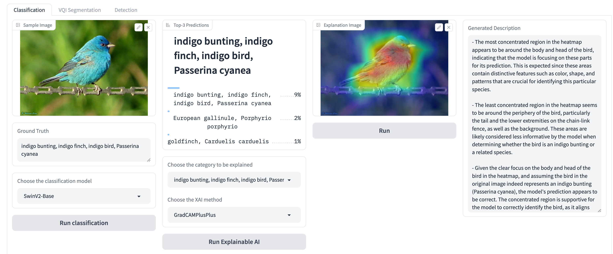

# LangXAI: XAI Explanations in Human Language

## Installation
```pip install -r requirements.txt```
## Usage
- Replace your GPT-4 API in the `config.py`
- The expert's labels are stored in `label.json`
- Download dataset and put in the `images` folder (Optional)
- Run LangXAI platform: ```python app.py```
- Choose tasks: Segmentation, Classification, Object Detection.
## Benchmark
- GPT-4 Vision

| Task                   | BLEU   | METEOR | ROUGE-L | BERTScore |
|------------------------|--------|--------|---------|-----------|
| Classification         | 0.2971 | 0.5122 | 0.5196  | 0.9341    |
| Semantic Segmentation  | 0.2552 | 0.4741 | 0.4714  | 0.8594    |
| Object Detection       | 0.2754 | 0.4904 | 0.4911  | 0.9093    |
