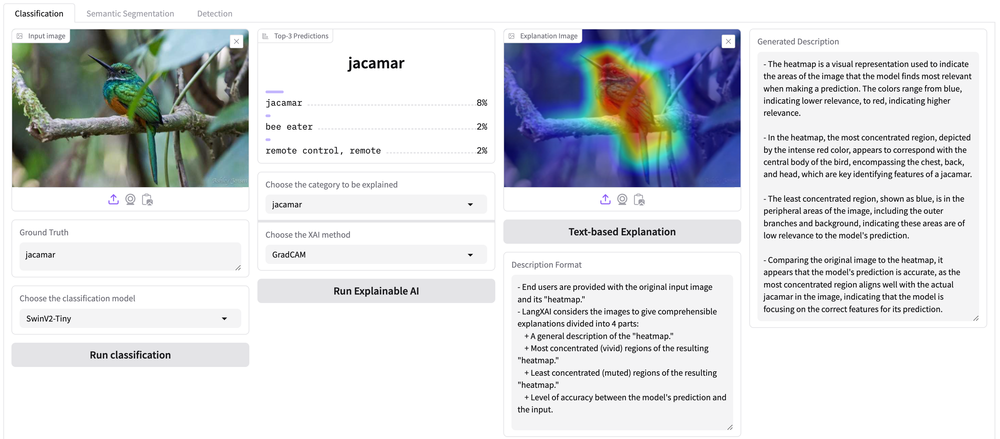

# LangXAI: XAI Explanations in Human Language

## Installation
- Install dependencies
```pip install -r requirements.txt```
- Setup OpenAI API key in `config.py`
- Download a fine-tuned DeepLabv3-ResNet segmentation models into `models` folder:
  - [DeepLabv3-ResNet50](https://drive.google.com/file/d/1NbEGJcCzKJDAKiniiHwRiXFSTDmC6GJg/view?usp=drive_link)
  - [DeepLabv3-ResNet101](https://drive.google.com/file/d/1KpW5ilZbwkuwtqw1TqPbOuSvoHPJ9w3i/view?usp=drive_link)
## Usage
- Run LangXAI platform:
```python app.py```
- Choose tasks: Semantic Segmentation, Classification, Object Detection.
## Benchmark
- GPT4-Vision

| Task                   | BLEU   | METEOR | ROUGE-L | BERTScore |
|------------------------|--------|--------|---------|-----------|
| Classification         | 0.2971 | 0.5122 | 0.5196  | 0.9341    |
| Semantic Segmentation  | 0.2552 | 0.4741 | 0.4714  | 0.8594    |
| Object Detection       | 0.2754 | 0.4904 | 0.4911  | 0.9093    |

## BibTeX
- If you find our work useful, I would be grateful if you cite our paper:
```
@article{nguyen2024langxai,
  title={LangXAI: Integrating Large Vision Models for Generating Textual Explanations to Enhance Explainability in Visual Perception Tasks},
  author={Nguyen, Truong Thanh Hung and Clement, Tobias and Nguyen, Phuc Truong Loc and Kemmerzell, Nils and Truong, Van Binh and Nguyen, Vo Thanh Khang and Abdelaal, Mohamed and Cao, Hung},
  journal={arXiv preprint arXiv:2402.12525},
  year={2024}
}
```