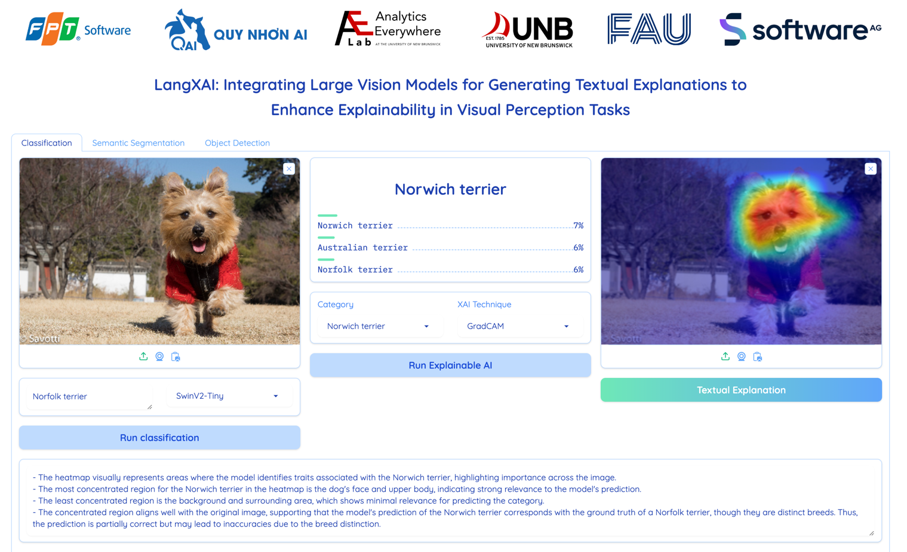

# LangXAI: Integrating Large Vision Models for Generating Textual Explanations to Enhance Explainability in Visual Perception Tasks

This repository contains the source code for the ["LangXAI: Integrating Large Vision Models for Generating Textual Explanations to Enhance Explainability in Visual Perception Tasks" paper, which is published at IJCAI 2024 Demo Track.](https://www.ijcai.org/proceedings/2024/1025)


## Installation
- Install dependencies
```pip install -r requirements.txt```
- Setup OpenAI API key in `config.py`
- Download a fine-tuned DeepLabv3-ResNet segmentation models into `models` folder:
  - [DeepLabv3-ResNet50](https://drive.google.com/file/d/1NbEGJcCzKJDAKiniiHwRiXFSTDmC6GJg/view?usp=drive_link)
  - [DeepLabv3-ResNet101](https://drive.google.com/file/d/1KpW5ilZbwkuwtqw1TqPbOuSvoHPJ9w3i/view?usp=drive_link)
## Usage
- Run LangXAI platform:
```python app.py```
- Choose tasks: Semantic Segmentation, Classification, Object Detection.
## Benchmark
- GPT4-Vision

| Task                   | BLEU   | METEOR | ROUGE-L | BERTScore |
|------------------------|--------|--------|---------|-----------|
| Classification         | 0.2971 | 0.5122 | 0.5196  | 0.9341    |
| Semantic Segmentation  | 0.2552 | 0.4741 | 0.4714  | 0.8594    |
| Object Detection       | 0.2754 | 0.4904 | 0.4911  | 0.9093    |

## BibTeX
- If you find our work useful, I would be grateful if you cite our paper:
```
@inproceedings{ijcai2024p1025,
  title     = {LangXAI: Integrating Large Vision Models for Generating Textual Explanations to Enhance Explainability in Visual Perception Tasks},
  author    = {Nguyen, Hung and Clement, Tobias and Nguyen, Loc and Kemmerzell, Nils and Truong, Binh and Nguyen, Khang and Abdelaal, Mohamed and Cao, Hung},
  booktitle = {Proceedings of the Thirty-Third International Joint Conference on
               Artificial Intelligence, {IJCAI-24}},
  publisher = {International Joint Conferences on Artificial Intelligence Organization},
  editor    = {Kate Larson},
  pages     = {8754--8758},
  year      = {2024},
  month     = {8},
  note      = {Demo Track},
  doi       = {10.24963/ijcai.2024/1025},
  url       = {https://doi.org/10.24963/ijcai.2024/1025},
}
```